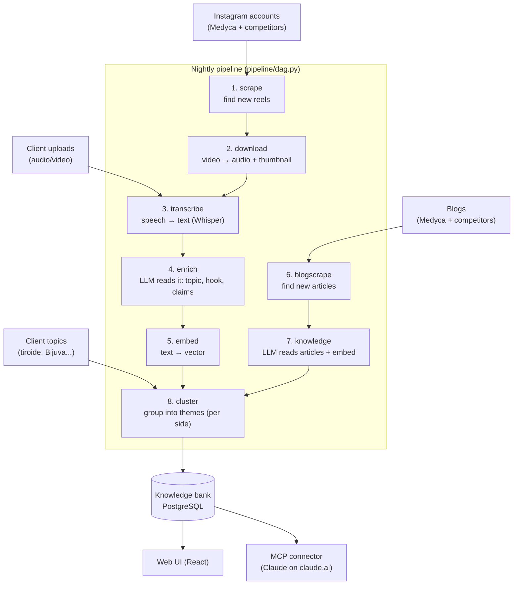
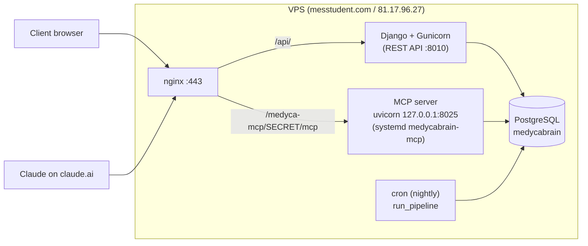

# High-level architecture

One page, plain language. The goal here is that you can picture the whole system before
reading any code. Details and file paths are in the [`low-level/`](../low-level/) docs.

## The idea in one sentence

Medyca publishes content about menopause and bioidentical hormone therapy. This platform
watches that content **and** its competitors', understands it, groups it by theme, and helps
Medyca decide what to publish next — always keeping *their* material separate from the
*competitors'* material.

## What comes in (four inputs)

1. **Medyca's own Instagram reels** — the account `@medyca.menopausa`.
2. **Competitor reels** — a list of tracked competitor Instagram accounts.
3. **Blog articles** — Medyca's blog (`medyca.it`) and a few monitored competitor blogs.
4. **Client uploads** — audio/video interviews the client uploads themselves (e.g. a doctor talking).

Plus one lightweight input: **client topics** — subjects the client says they care about
("tiroide", "osteoporosi", "Bijuva") so the platform can track coverage of them specifically.

## What happens to it (the pipeline)

Everything runs through the same eight steps, in order. Each step only does the rows that
are ready for it, so the pipeline is safe to re-run every night.

In words:

- **scrape** finds new reels on each tracked account.
- **download** pulls each reel's video, extracts the audio and a thumbnail, then throws the
  heavy video away.
- **transcribe** turns the audio into text (Whisper).
- **enrich** has an LLM read each piece and pull out the useful bits: the single specific
  topic, the hook, the target audience, and short **claims** — each backed by a *verbatim
  quote* so nothing is invented.
- **embed** turns the text into a vector (a list of numbers) so we can measure "how similar
  are these two pieces".
- **blogscrape** + **knowledge** do the same for blog articles.
- **cluster** groups everything into themes — **separately for Medyca and for competitors**,
  so the two sides never blur together.

## The core rule: Medyca vs competitors are never mixed

Every piece of content carries an `owner_type` of either `owned` (Medyca) or `competitor`.
This single label decides what feeds the client's own knowledge (their reels + their blog +
their uploads) versus what is only *inspiration/comparison* (competitors). Clustering runs
once per side, the chat keeps sources labelled, and the whole system treats confusing the two
as its worst possible mistake.

## What comes out

Stored in one PostgreSQL database (the **knowledge bank**) and reachable two ways:

**A) The web UI** (React app):
- **Library** — every reel/article, searchable.
- **Analytics** — engagement, weighted by real performance.
- **Themes / Brain Map** — the clusters, and a graph of how themes connect.
- **Knowledge Bank chat** — ask a question, get an answer grounded only in the content, with
  clickable `[n]` citations.
- **Second Brain** — an editorial planner: content ideas, gaps competitors cover that Medyca
  doesn't, strategy briefs, and blog drafts.

**B) The MCP connector** — the same knowledge, exposed to Claude on claude.ai as four
read-only tools: `panoramica` (overview counts), `cerca` (semantic search), `leggi` (read one
item in full), `temi` (the current themes). See [04-mcp-connector.md](low-level/04-mcp-connector.md).

## How the pieces are deployed

- The **REST API** (Django + Gunicorn) serves the React app.
- The **MCP server** is a *separate* process (its own systemd service) so a slow Claude query
  can never tie up a web request. It still talks to the same database through the same Django
  models.
- **nginx** terminates HTTPS and routes `/api/` to the backend and the secret MCP path to the
  MCP server.
- **cron** runs the pipeline nightly. There is no message queue — background work uses simple
  `Job` rows in the database.

## Technology, briefly

- **Backend:** Python, Django + Django REST Framework, one app called `core`. PostgreSQL 16.
- **Frontend:** React 18 + TypeScript + Vite + Tailwind.
- **LLM:** vendor-neutral — the code asks for a *tier* ("analysis", "reasoning", "bulk") and
  the actual model id comes from config. Speech-to-text is Whisper. Search embeddings use a
  local multilingual MiniLM model.
- **Vectors:** stored as JSON columns in Postgres; similarity is computed in NumPy in-process
  (no pgvector). Fine at this corpus size.

Next: the [data model](low-level/01-data-model.md).
