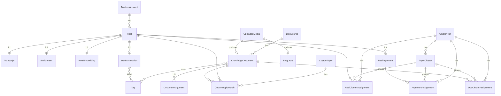

# Low-level: the data model (database structure)

All tables live in **one Django app, `core`**. Source of truth:
**`BEC/core/models.py`** (the header says *"All tables for the medycabrain POC live in this
single app."*). This page is the map of that file.

The database is **PostgreSQL** (db name `medycabrain`, configured in
`BEC/config/settings/base.py` via `DATABASE_URL` or discrete `DB_*` env vars).

## Two labels you must understand first

Almost everything hangs off these two ideas:

- **`owner_type`** — `"owned"` (Medyca's own content) or `"competitor"`. It decides what feeds
  the client's knowledge versus what is only comparison. It appears on `TrackedAccount`,
  `BlogSource`, and — **denormalised and authoritative** — on `KnowledgeDocument`.
  > **Rule:** for a document, always read `doc.owner_type`. Do **not** follow the FK to
  > `source.owner_type`. The value is copied onto the document on purpose so the query path
  > stays simple and a re-parented source can't silently flip a document's side.
- **`source_type`** (on `KnowledgeDocument`) — `"blog"`, `"manual"` (a client upload), or
  `"other"`. Says *where a text document came from*.

## Shared vocabulary

- **`STATUS_CHOICES`**: `pending` / `done` / `failed` / `skipped` / **`batched`**. Used by the
  per-row "stage" columns that make the pipeline idempotent (see below). `batched` means the row
  was handed to the Batch API and is waiting for its answer — a real state, not a flavour of
  `pending`: the pending query cannot see it, which is what stops the next nightly run from
  resubmitting the same work and paying twice (migration `0020`).
- **`CONTENT_FORMATS`**: `talking_head`, `voiceover`, `tutorial`, `testimonianza`,
  `text_overlay`, `intervista`, `altro`.
- A failed row stays `failed`. It is never silently reset to `pending` to retry forever —
  retry is an explicit action (`reprocess`, or the `reactivate/` endpoint for blog sources).

## ER diagram

Not drawn (no hard FKs, they are outputs / bookkeeping): `BlogDraft`, `ContentIdea`,
`StrategyBrief`, `Job`, `ScraperConfig`, `BatchRun`.

## The tables, grouped by role

### Inputs (where content enters)

**`TrackedAccount`** — `tracked_accounts`. A public Instagram account we scrape.
- Key fields: `username` (unique), `display_name`, `ig_user_id`, `followers_count`,
  **`owner_type`** (`owned`/`competitor`), `is_active`, `scrape_state` (JSON: `end_cursor`,
  `consecutive_failures`, `last_error`, `provider`), `last_scraped_at`.
- Relationship: `1:N` → `Reel` (`related_name="reels"`).

**`BlogSource`** — `blog_sources`. A crawled blog. The article-world analog of a tracked
account (deliberately *not* a shared base class).
- Key fields: `name`, `site_url`, `index_url` (unique), **`owner_type`**, `language`,
  `is_active`, `crawl_interval_h` (default `168` = weekly), `strategy`
  (`unknown|sitemap|feed|index|mixed`), **`discovery`** (JSON — learned sitemap/feed + article
  URL patterns, classified once per site by an LLM and cached), `crawl_state` (JSON),
  `consecutive_failures`, `last_error`, `last_crawled_at`.
- After N consecutive failures the source auto-deactivates; reactivation is a human action.
- Relationship: `1:N` → `KnowledgeDocument` (`related_name="documents"`).

**`UploadedMedia`** — `uploaded_media`. Media the client brought in himself, **by file or by
link** (a doctor interview; a TV episode on YouTube or Vimeo kept as reference).
- Key fields: `file` (→ `uploads/{uuid}.{ext}`, **blank for a link**), `kind` (`audio`/`video`),
  `original_name`, `title`, `size_bytes`, `duration_s`, `audio_file` (derived mp3),
  `transcribe_status`.
- Link fields: **`source_url`** (the public page, in the canonical form `link_ingest` produces,
  which is what makes it dedupable; empty for a file upload), **`channel`** (the publisher, from
  oEmbed — e.g. `YouTVRS` on YouTube, `TVRS SRL` on Vimeo). The **host is read back from
  `source_url`** (`link_ingest.provider_for`): there is deliberately no provider column, because
  it would be a migration for information already in the string.
- Two independent flags, deliberately not one: **`owner_type`** (`owned`/`competitor` — WHOSE it
  is, which decides whether it counts as Medyca's coverage in the gap engine) and
  **`is_inspiration`** (WHY it is here — reference material the client added on purpose). A
  competitor's episode can be inspiration; so can one of his own TV appearances. Before this,
  every upload was hardcoded `owned`.
- Results: FK **`document`** → `KnowledgeDocument` (SET_NULL) and FK **`blog_draft`** →
  `BlogDraft` (SET_NULL) — filled once transcribed and turned into material + a draft. A link
  whose audio could not be fetched still gets a `document` (title + channel + link, no
  transcript), so the reference is not lost; the row stays `failed` with the reason.

**`CustomTopic`** — `custom_topics`. A subject the client says they care about.
- Key fields: `label` (unique), `keywords` (JSON), `embedding` (JSON), `is_active`.
- Persists across cluster runs (unlike `TopicCluster`, which is regenerated each run).

**`ScraperConfig`** — `scraper_config`. Runtime key/value config, admin-editable.
- `key` (PK), `value` (JSON). Classmethod `ScraperConfig.get(key, default)`. Holds e.g. rate
  discipline and the clustering distance threshold.

### Reels and their derived layers

**`Reel`** — `reels`. FK **`account`** → `TrackedAccount` (CASCADE).
- Identity/metrics: `shortcode` (unique), `ig_media_id`, `caption`, `posted_at`,
  `duration_s`, `view_count`, `like_count`, `comment_count`, `video_url` (ephemeral CDN),
  `thumbnail_url`, `thumbnail_file`, `audio_file`, `audio_info` (JSON), `raw_json_path`.
- **Idempotent stage columns** (each `STATUS_CHOICES`, each indexed):
  **`media_status`, `transcribe_status`, `enrich_status`, `argument_status`**, plus
  `media_attempts`, `last_error`, `is_active`. These are what let the pipeline re-run: a stage
  only touches rows whose column is `pending`.

**`Transcript`** — `transcripts`. **1:1** with `Reel`.
- `text`, `language` (default `it`), `segments` (JSON `[{start,end,text}]`), `model_name`,
  `audio_duration_s`.

**`Enrichment`** — `enrichments`. **1:1** with `Reel`. What the LLM extracted.
- `summary_it`, `topics` (JSON list), `hook_text`, `hook_analysis_it`, `target_audience_it`,
  `content_format`, `llm_model`, **`evidence`** (`transcript`/`caption_only`/`insufficient`),
  **`primary_topic`** (the *one* specific subject — never the generic "menopausa"),
  `is_on_topic`, `off_topic_reason`, `raw_response` (JSON).

**`ReelEmbedding`** — `reel_embeddings`. **1:1** with `Reel`. The vectors.
- `vector` (JSON `list[float]` — the whole-reel vector), **`chunk_vectors`** (JSON
  `list[list[float]]`, one per passage, order matches `core.knowledge._chunks`), `model_name`,
  `created_at`, **`updated_at`** (bumped on every re-embed; the chat's index cache keys on it
  to notice in-place changes).

**`ReelArgument`** — `reel_arguments`. FK **`reel`** (CASCADE, `related_name="arguments"`). A
single standalone claim made in the reel.
- `text_it` (the claim), **`quote`** (the *verbatim* transcript span that backs it — empty
  means ungrounded, which must not be stored), `embedding` (JSON).

### Blog / knowledge documents (mirror of reels, for text)

**`KnowledgeDocument`** — `knowledge_documents`. A text document in the knowledge bank.
- Provenance: **`source_type`** (`blog`/`manual`/`other`), FK **`source`** → `BlogSource`
  (SET_NULL), **`owner_type`** (`owned`/`competitor`, `db_index` — authoritative/denormalised),
  `language`, `content_hash`, `source_url` (unique), `author`, `published_at`.
- Content: `title`, `content_md`, `content_text`.
- LLM output: `summary_it`, `topics`, `primary_topic`, `is_on_topic`, `off_topic_reason`.
- Vectors inline: `embedding` (JSON), `chunk_vectors` (JSON), `embedding_model`.
- **Stage columns:** `enrich_status`, `embed_status`, `argument_status`, `last_error`.
- M2M **`tags`** → `Tag`; `is_active`.
- Medyca's `owned` reels + these `owned` documents together = the client's knowledge bank.
- **`is_inspiration`** — reference material the client added on purpose. Deliberately NOT a
  third `owner_type`: 26 call sites read that field as a binary and ten would silently file a
  third value under Medyca, including the enrichment prompt that says "il blog di Medyca
  stessa". It also **exempts the row from the `is_on_topic` filter** in the search index
  (`core/knowledge.py`) and in clustering: the on-topic verdict is given against a
  menopause-centred prompt that rejected 404 of 835 articles on 2026-09-13, so a TV episode
  on prediabetes would vanish the moment it was added. A model's verdict must not delete a
  human's choice.
- `source_type` gained **`video`**; for a linked video `source_url` is the REAL page url
  (not the synthetic `upload://…`), and its `unique=True` makes pasting the same link twice
  a no-op instead of a duplicate.

**`DocumentArgument`** — `document_arguments`. The article version of `ReelArgument`.
- FK **`document`** (CASCADE, `related_name="arguments"`), `text_it`, `quote` (verbatim),
  `embedding` (JSON).

### Clustering / themes

**`ClusterRun`** — `cluster_runs`. One row per clustering pass.
- **`scope`** (`owned`/`competitor` — the two sides are clustered separately), `algorithm`,
  `params` (JSON), `n_reels`, `n_clusters`, `n_noise`, `status` (`running|done|failed`),
  **`is_current`** (exactly one current per scope; indexed on `(scope, is_current)`). The API
  only ever serves `is_current=True`, and the flag is flipped atomically at the end of a run.

**`TopicCluster`** — `topic_clusters`. FK **`run`** (`related_name="clusters"`). One theme.
- `label_it`, `description_it`, `size`, `keywords` (JSON), **`centroid`** (JSON — used to
  match a theme to the previous run so labels stay stable when centroid cosine ≥ 0.80),
  `position`.

Three assignment tables tie content to a cluster *within a run*:
- **`ReelClusterAssignment`** — `reel_cluster_assignments`. FKs `run`, `reel`, `cluster`
  (nullable = noise); `probability`; `unique_together (run, reel)`.
- **`DocClusterAssignment`** — `doc_cluster_assignments`. FKs `run`, `document`, `cluster`;
  `probability`; `unique_together (run, document)`. This is what lets one theme span **both**
  reels and articles.
- **`ArgumentAssignment`** — `argument_assignments`. FKs `run`, `argument` (→ `ReelArgument`),
  `cluster`; `similarity`; `unique_together (run, argument)`. (Layer-2 claim clustering is
  reel-only.)

**`CustomTopicMatch`** — `custom_topic_matches`. Ties a client topic to content it matches.
- FK **`topic`** → `CustomTopic`, nullable FK **`reel`**, nullable FK **`document`**,
  **`scope`** (`owned`/`competitor`), `similarity`, **`via`** (`semantic`/`keyword`/`both`).
  Indexed `(topic, scope)`.

### Workspace, outputs, and bookkeeping

**`Tag`** — `tags`. `name` (unique), `color`, **`auto`** (True = generated from an LLM
`primary_topic` by the `autotag` command).

**`ReelAnnotation`** — `reel_annotations`. **1:1** with `Reel`. The human layer.
- `is_favorite`, `is_inspiration`, `note`, M2M **`tags`** → `Tag`
  (`related_name="annotations"`).

**`BlogDraft`** — `blog_drafts`. A cluster-driven blog output.
- `mode` (`expand`/`draft`), `cluster_label`, `title`, `content_md`, `source_refs`
  (JSON `[{kind,title,url}]`), `llm_model`, `status` (`proposed|saved|dismissed`).

**`ContentIdea`** — `content_ideas`. A Second-Brain content angle.
- `argument_it`, `rationale_it`, `angle_it`, `hook_it`, `outline` (JSON `[{step,note}]`),
  `cta_it`, `content_format`, **`scope`**, **`is_gap`** (competitors cover it, Medyca doesn't),
  `source_refs`, `status`, `batch`.

**`StrategyBrief`** — `strategy_briefs`. Output of the input-driven strategy engine.
- `input_text`, `source_kind` (`input`/`theme`), `coverage` (`covered|partial|gap`),
  `brief_md`, `draft_md` (on demand), `medyca_sources`/`competitor_sources`/`metrics` (JSON),
  `status`, `brief_model`, `draft_model`.

**`BatchRun`** — `batch_runs`. One delivery to the Batch API: the receipt we come back with.
- `kind` (`enrich`), `batch_id` (the provider's id, unique), `model`, `status`
  (`submitted|ended|collected|failed|canceled`), **`items`** (JSON
  `[{custom_id, reel_id, evidence}]`), `counts` (JSON), `last_error`, `submitted_at`,
  `collected_at`.
- `items` is the mapping that makes collection safe: **results come back in any order and are
  matched by `custom_id`** (`reel-1251`), never by position. Matching by position would file one
  reel's analysis under another reel — silent and permanent.
- No FK to `Reel` on purpose: the row must survive a reel being deleted mid-flight, and the
  batch is bookkeeping about a payment, not part of the content graph.

**`Job`** — `jobs`. A background job (there is no queue; the API polls these rows).
- `kind` (`ideation|pipeline|blog|strategy|strategy_draft|editorial|blogsource_discover|upload_transcribe`),
  `status` (`queued|running|done|failed`), `progress` (0–100), `message`, `params`/`result`
  (JSON), `error`, `finished_at`; helper `set_progress()`.

## Why embeddings are JSON, not pgvector

Every vector (`ReelEmbedding.vector`/`chunk_vectors`, `KnowledgeDocument.embedding`/
`chunk_vectors`, `ReelArgument.embedding`, `DocumentArgument.embedding`, `CustomTopic.embedding`,
`TopicCluster.centroid`) is a plain **JSON column**. There is no pgvector extension.
Similarity is computed **in NumPy, in-process**, over a cached in-memory index (see
[03-llm-and-embeddings.md](03-llm-and-embeddings.md)). At this corpus size (hundreds to low
thousands of items) a matrix multiply is fast and keeps the deployment simple — no extension
to install, no ANN index to maintain. If the corpus grows by an order of magnitude, moving to
pgvector is the obvious next step.

Next: the [pipeline](02-pipeline.md).
