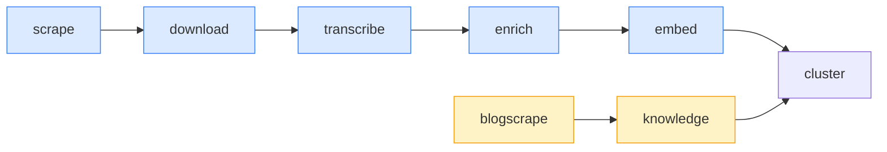

# Low-level: the processing pipeline

How raw content becomes searchable knowledge. This is the eight-stage nightly job.

## Where it lives

- **Runner:** `BEC/pipeline/dag.py` — a small linear DAG. It holds an ordered list of
  `Step(name, fn, fatal=False)` and runs them with `DAG.run(ctx, only, skip)`. Every step is
  **non-fatal**: if `scrape` fails, the later stages still run on whatever is already in the
  database.
- **Entry point:** `BEC/core/management/commands/run_pipeline.py`. Its docstring says
  *"DAG entrypoint (cron calls this)"*.
- **One agent per stage:** `BEC/pipeline/agents/<stage>_agent.py`, each exposing `run(...)`.

`pipeline/` is a plain Python package, **not** a Django app.

## The eight stages, in order

`STAGE_NAMES` (in `run_pipeline.py`):

```
scrape → download → transcribe → enrich → embed → blogscrape → knowledge → cluster
```



| # | Stage | Agent file | What it does | Sets next state |
|---|---|---|---|---|
| 1 | **scrape** | `scraper_agent.py` | For each active `TrackedAccount`: list recent reels **through Apify** (see [below](#where-the-list-of-reels-comes-from)) at a per-account adaptive depth, dump raw JSON to `data/raw/{account}/{shortcode}.json`, upsert `Reel` rows. Stops on the request budget **and** on the Apify spending ceiling. | `media_status=pending` |
| 2 | **download** | `downloader_agent.py` | For `media_status=pending`: get the mp4 (three sources, cheapest first — [below](#how-a-reels-video-actually-arrives)), ffmpeg-extract audio → `media/audio/{account}/{shortcode}.mp3`, save thumbnail → `media/thumbs/…`, delete the mp4. 3 attempts then `skipped`; a block defers the reel instead of charging it an attempt. | `media_status=done`, `transcribe_status=pending` |
| 3 | **transcribe** | `transcriber_agent.py` | faster-whisper (local CPU, int8) over each mp3 → `Transcript`. Remote STT (`llm.client.transcribe_audio`) is used instead when `USE_REMOTE_STT`. Also processes `UploadedMedia`. | `transcribe_status=done`, `enrich_status=pending` |
| 4 | **enrich** | `enrich_agent.py` | One LLM call per `enrich_status=pending` reel → `Enrichment` (summary, topics, hook, target, format, `primary_topic`, `evidence`). Runs `ENRICH_WORKERS` (default 5) in parallel. Then extracts `ReelArgument`s for `argument_status=pending` — each with a required **verbatim quote**. | `enrich_status=done`, `argument_status` advanced |
| 5 | **embed** | `embed_agent.py` | Give every enriched reel a `vector` (via `cluster_agent._ensure_reel_embeddings`) and compute `chunk_vectors` passage embeddings for reels **and** documents (`_embed_passages`). Split from `enrich` on purpose so "analysed" and "searchable" can never drift apart. | embeddings written |
| 6 | **blogscrape** | `blogscrape_agent.py` | For each active `BlogSource`, self-throttling on `crawl_interval_h`: discover article URLs (`blog_discovery.py`) and ingest new ones (`blog_agent.py` — trafilatura → Markdown → `KnowledgeDocument`). Deactivates a source after N consecutive failures. | new `KnowledgeDocument` rows |
| 7 | **knowledge** | `knowledge_agent.py` | Enrich + embed blog articles (Medyca's and competitors'), using `model_for("analysis")`: `primary_topic`, on-topic verdict, `DocumentArgument` extraction (verbatim quote required). No hook/format — those are video-craft only. | `enrich_status`/`embed_status`/`argument_status=done` |
| 8 | **cluster** | `cluster_agent.py` | Two-layer clustering (below). Writes a fresh `ClusterRun` **per scope**, flips `is_current` atomically, then refreshes `CustomTopic` matches (`core/custom_topics.recompute_matches`). | new current `ClusterRun` per scope |

## Where the list of reels comes from

Downloading a reel and knowing *which* reels exist are two different problems,
and only the first one is easy. This section is the one to read before anyone
proposes changing the collection path again.

### What is closed, and why (measured 2026-09-11)

| Path | Status |
|---|---|
| Anonymous profile listing | `GET /api/v1/users/web_profile_info/` → **`401 {"require_login": true}`**. The profile page redirects to `/accounts/login/`. |
| **yt-dlp** listing an account | Impossible. Its `InstagramUserIE` carries `_WORKING = False` and a `_QUERY_HASH` Instagram retired. Tested on 2026.07.04 and 2026.08.19 — both fail. |
| instaloader | Removed its anonymous branch in March 2026; the endpoint requires a session. |
| Logged-in session (`ig_client.py`) | Works, but was removed on 2026-07-29: it ran as a personal account, and the log shows Instagram had begun blocking it — **23 checkpoint/401 blocks on 26 July, 15 more on the 29th**, plus the session file being reissued on the 26th. |
| Mirror sites (Picuki, Picnob, Pixwox, Pixnoy, Imginn) | All **403** to this VPS. Picuki has served nothing since 2025. |
| Meta Graph API | Supported in code (`graph_client`), takes precedence when `IG_GRAPH_TOKEN` is set. Not configured, by the client's decision. |

**What is open:** a single reel, given its shortcode, is fetchable anonymously —
which is exactly what `yt-dlp` does in stage 2, and why it stays there.

### The split that resolves it

- **Apify lists.** `apify/instagram-reel-scraper` returns the recent reels of an
  account — shortcode, caption, counts, timestamp and a signed `videoUrl` — from
  Apify's own infrastructure. **No Instagram account of ours is involved.**
- **yt-dlp downloads.** Free, anonymous, already proven (3/3 reels, 4-6 s each,
  re-verified 2026-09-11).

A useful side effect: because the scrape call already returns a fresh `videoUrl`,
a reel collected and downloaded in the same run costs nothing extra — the
downloader's Apify prefetch finds a usable url and never fires. Measured on the
first real collection: `apify_accounts: 0, apify_urls: 0`.

## The money, and what stops it

`scraper/apify_budget.py`. The plan is **Apify FREE: $5.00 per cycle, renewing
monthly** (verified 2026-09-11, cycle 27 Aug → 26 Sep). Not a one-off allowance,
but a hard wall — past it the actor stops answering and collection dies quietly.

**Prices**, read from the actor's own pricing (PAY_PER_EVENT, FREE tier):

| Event | Price | |
|---|---|---|
| `reel` | **$0.0026** | every result returned, new or already known |
| `actor-start` | **$0.0010** | flat, once per account queried |
| `shares-count` | $0.0070 | ⛔ never enabled |
| `video-download` | $0.0200 | ⛔ never enabled — yt-dlp does it free |
| `transcript` | $0.0480 | ⛔ never enabled — the pipeline transcribes itself |

The three add-ons are **one JSON field away** and cost up to **18×** the base
price. `apify_provider.fetch_reels` therefore sends a closed payload — only
`username` and `resultsLimit` — and the restriction is a comment in the code as
well as a line here, because a stray field would burn a cycle in one night.

### Three defences, in order

1. **The ceiling.** `apify_budget.check()` asks Apify what the cycle has already
   cost, adds what the call is about to cost, and refuses past
   `ScraperConfig["apify_ceiling_usd"]` (default **$4.00** — below the plan's $5
   on purpose, so a mis-estimate cannot reach zero). A refusal surfaces as
   `ApifyUnavailable`, which every caller already treats as "this source cannot
   help right now". The scrape stage says it once and skips the rest of the
   accounts rather than logging a dozen identical failures.
2. **Adaptive depth.** Every result is billed whether or not it is new, so
   asking a fixed depth of everyone makes the quiet accounts pay the prolific
   ones' price — measured posting rates here range from every 0.1 days to every
   34 days. `_apify_depth()` asks for *the gap since their last known post
   divided by how often they post, plus three*, clamped to
   `[3, ScraperConfig["apify_max_depth"]=30]`.
3. **The prefetch cap.** `downloader_agent._prefetch_urls` used to ask for
   `known + 60`. On this plan that is the most expensive thing the pipeline can
   do: `menopausa_insieme` has 124 known reels → 184 results → **$0.48 for one
   account, one night**, and roughly **$3.70 across twelve** — a whole cycle, to
   fetch urls yt-dlp does not need. Now capped at `_PREFETCH_MAX_DEPTH = 30`.

### What it actually costs

Measured, not estimated:

- Catching up the six-week gap across the 12 live accounts: **~$0.71, once.**
- Steady state, 12 accounts: **$3.17/month nightly**, **$1.58/month every two
  days**, $1.12/month weekly.
- First real collection (`@medyca.menopausa`, depth 9, 1 new reel): **$0.014.**

The estimate in `estimate_usd()` assumes every account returns the full depth,
so it runs **pessimistic** — the first real run was billed less than estimated.
That is the right direction to be wrong in on a $5 plan.

### Known limits

- **11 of the 23 tracked accounts are dead weight.** Eight have never returned a
  single reel (one, `elena,palliotto`, has a comma where a dot belongs — the
  username is simply wrong), and `buonarroti_medical_center` last posted in
  January 2025. Querying them costs `actor-start` for nothing. They should be
  diagnosed once and deactivated; until then they are billed.
- **Reels only.** Stories, carousels and static posts are not collected.
- **The ceiling stops collection, nothing else.** Transcription, analysis,
  clustering and the whole interface keep working on what is already in the bank.
- **Apify is an external dependency.** If the actor changes its output or its
  prices, this stage changes with it.

### How a reel's video actually arrives

Stage 2 is the only stage that touches Instagram, and Instagram is the part of the
system that fights back. There is no official way to download a reel's mp4, so the
downloader tries **three sources, cheapest and safest first**, and falls through.


**1. Apify prefetch** (`_prefetch_urls`, only when `apify_provider.enabled()`). One actor
call per account fills `video_url` for the whole batch, plus any missing caption /
thumbnail / counters. Depth is `max(reels known for that account, reels in this batch) + 60`
— a flat margin, because our pending rows sit scattered through the account's real
timeline, not at the top of it: a first attempt sized from the batch asked for 7 reels and
matched 0 of them. Overshooting costs a fraction of a cent; undershooting wastes the call.

**2. The cached CDN url.** Instagram signs media urls with `oe=<hex unix timestamp>`;
past it the CDN answers 403. `_url_expired()` reads that parameter with a 15-minute margin.
A url with no `oe=` is assumed good — the download attempt decides. This path is a plain
`requests` GET against the CDN, which has **no quota**, so the run does not pace itself here.

**3. yt-dlp on the public permalink** (`_ytdlp_fetch`). Downloads
`https://www.instagram.com/reel/<shortcode>/` **anonymously — no account, no cookies**.
This replaced the old renewal path (`/api/v1/media/{pk}/info/`), which needed a logged-in
session and was removed on **2026-07-29** because it ran as Giuseppe's personal account.
Measured from this VPS on **2026-07-30**: 3/3 reels, 6-8s each, valid MP4s with correct
durations.

#### The limits, written down before the next person hits them

- **yt-dlp is unofficial.** Instagram can block the IP or change the page at any time.
  A block arrives as a `yt_dlp.utils.DownloadError` whose text mentions *login*, *rate*,
  *429* or *wait a few minutes* — mapped to `IGThrottled` so the run **defers** instead of
  burning three attempts per reel on a wall that is not the reel's fault.
- **A block ends the run early, on purpose.** After the 3rd block (`_THROTTLE_STREAK`,
  counted *total*, not consecutive) the run sets `stopped_early` and from then on skips only
  the reels that would need the network — reels holding a fresh url keep going. Counting
  consecutively was the bug: a run alternates between reels that succeed and reels that are
  blocked, every success reset the streak, and the run paid the 20-40s pacing sleep on every
  doomed call — **2 reels/min instead of ~12**.
- **Pacing applies only after a web hit.** `_process_one` returns `used_api`; the loop sleeps
  `uniform(download_delay_s, 2 × download_delay_s)` only when the previous reel actually went
  out to Instagram. Sleeping after CDN cache hits would waste hours.
- **A reel can be silent.** `has_audio=False` means every video stream is video-only:
  transcription is skipped and the reel goes straight to enrichment on its caption.
- **Order and cap.** Medyca's own reels first (`owner_type="owned"`), then each competitor's
  best-performing ones, so a 122-reel account cannot starve the other twelve. Per-run size is
  capped by `ScraperConfig["download_max_per_run"]`; the backlog drains across runs.
- **`_fetch_media_details` still exists** and is still the only source of the richer metadata,
  but it needs cookies. With no session file it raises `IGThrottled` rather than failing the
  reel.

### What "cluster" actually does

- **Layer 1 (content → themes).** Embed each enriched reel + the `owned`/`competitor`
  documents. Cluster with **HDBSCAN** (`min_cluster_size=4`, `min_samples=2`; requires n ≥ 60,
  ≥ 3 clusters, noise ≤ 0.6). If that fails the size test, fall back to **Agglomerative**
  (cosine, `distance_threshold` from `ScraperConfig`, default `0.30`). Each cluster is named in
  Italian by one LLM call (`model_for("analysis")`). A new cluster reuses the previous run's
  label when centroid cosine ≥ 0.80, so themes keep stable names run to run.
- **Layer 2 (claims → themes).** Assign each `ReelArgument` to the nearest centroid; cosine
  < 0.35 counts as noise.
- Runs **once per scope** (`owned`, then `competitor`) — the two sides never share a cluster.

## Starting a run by hand

The pipeline used to run only from cron, which meant that adding an account or a
blog source and then wanting to see the result involved waiting for the night.
The status page now has an **Aggiorna ora** button.

- `POST /api/v1/ops/run/` (`PipelineRunView`) queues a `Job(kind="pipeline")` and
  `run_job` executes it detached, exactly like every other background job.
- The work itself is `core/pipeline_run.py` → `pipeline.dag.build_steps()`. **The
  stage list lives in `pipeline/dag.py`, not in the management command**, because
  there are now two callers and two copies would eventually disagree about what
  "the pipeline" is. `manage.py run_pipeline` uses the same function.
- `DAG.run(..., on_step=…)` reports each stage as it begins, so the `Job` row
  carries a percentage and a stage name the interface can show. The cron
  entrypoint passes no callback and behaves exactly as before.
- **The output is teed into `logs/pipeline.log`** as well as the job's own log.
  Everything that reports on the pipeline reads that file — the run timeline in
  `core/ops.py`, the per-item rates below — so a manual run that wrote only to
  `logs/jobs/job-<id>.log` would be invisible to the very page that started it.
- A stage that fails does **not** fail the job: every step is non-fatal by
  design, and the stages that did run really did their work. The job finishes
  with `Completato, ma senza: <stages>` and `result.failed_stages`.

**Only one run at a time, and the guard is wider than the `jobs` table.** A
second concurrent run is not merely wasteful: the downloader paces itself against
Instagram's quota, and two runs double the request rate against the limit that is
already the bottleneck. So the view checks both the job rows *and* the process
table (`ops.activity()`) — the nightly cron run leaves no row in the database and
is the run most likely to be in progress when someone presses the button. Either
way the answer is **409** with a sentence saying so.

## How much is left, and how long it takes

`core/queue_eta.py`, served inside `/ops/status/` as `queue`, and shown by
`PipelineQueue` on the status page. It exists because the stage bars answer *how
far has it got* and the client asks *quanto manca* — and a percentage cannot say
whether the remainder is ten minutes or ten hours.

**How many.** The pending counts on the rows themselves — the same ones each
agent selects from — carried forward: a reel waiting to be downloaded will also
have to be transcribed and analysed, so it counts once per stage it has still to
cross. `remaining` (the headline number) is distinct reels with at least one
stage pending.

**How long.** Seconds per item, read from the `✓ <stage> done in <n>s — {…}`
lines the DAG writes into `logs/pipeline.log`, over the **last 5 runs that
actually processed something**. The window is small on purpose: the per-item cost
of this pipeline has changed by more than an order of magnitude as its models
changed — transcription measured **245 s/reel** on local faster-whisper and
**4.1 s/reel** on remote STT. An average over all history would describe a
machine that no longer exists. A run that handled zero items is skipped
entirely: its duration is start-up cost, and averaging it in drags every
estimate towards zero.

| Stage | Status columns it drains | Result keys counted as items |
|---|---|---|
| `download` | `media_status` | `downloaded`, `failed`, `skipped` |
| `transcribe` | `transcribe_status` | `transcribed`, `failed` |
| `enrich` | `enrich_status` **and** `argument_status` | `enriched`, `arg_reels` |

`enrich` carries two columns on purpose. Extracting the claims is **not** a
separate stage — `enrich_agent.run` analyses the reels and then extracts the
claims inside the same step, and the log records one duration covering both.
Giving the claims their own stage would count that duration twice, so they are
counted as a second kind of item inside the stage that does the work. A reel
arriving at `enrich` therefore becomes two items, not one.

### What the estimate does not cover

- **Download is the unreliable one.** Measured between **9 and 77 s/reel** across
  runs, because the cost depends on how many urls Apify pre-filled (a cached CDN
  url is a plain fast fetch) and on whether Instagram starts throttling mid-run,
  in which case the run stops early and the rest waits for the next one. The UI
  says so in as many words rather than presenting one number as a promise.
- **Silent reels skip transcription** (`transcribe_status='skipped'`), so the
  forward-carry counts a few items that will never be transcribed. The estimate
  is slightly pessimistic, which is the right direction to be wrong in.
- **Failed rows are not work.** They stay `failed` by design and are not
  auto-retried, so they are reported next to each stage but never inside the ETA.
- **Only reels.** Blog articles and uploaded interviews are not in this queue.
- **No history, no measurement.** Until the log holds a productive run for a
  stage, a documented default is used and the panel says the number is a
  starting estimate, not a measurement (`measured: false`).

## The idempotency contract

The pipeline is safe to run on a fixed schedule because **state lives on each row**, not in
the runner. A stage selects only rows in the `pending` state for its column, does its work,
and advances the column. Re-running does no double work. Failures stay `failed` and are *not*
auto-reset — see [01-data-model.md](01-data-model.md#shared-vocabulary).

## Management commands

All under `BEC/core/management/commands/`. Run with `python manage.py <name>`.

| Command | Purpose |
|---|---|
| `run_pipeline` | Run the DAG (cron entrypoint). Flags: `--dry-run`, `--limit`, `--only <stage>`, `--skip-<stage>`. Stages come from `pipeline.dag.build_steps()`, shared with the manual run. |
| `run_job <id>` | Execute a queued `Job` by id, detached. |
| `reprocess` | Re-run stages (`transcribe`, `enrich`, `knowledge`), resumable. Flags: `--stage`, `--scope`, `--limit`, `--only-stale`, `--with-transcript`, `--not-model`. |
| `ingest_blog` | Fetch a specific Medyca blog article (or several). |
| `import_apify` | Fill `video_url`/`caption`/`posted_at`/`duration` from an Apify export. |
| `backfill_meta` | Backfill `posted_at` and other metadata. |
| `autotag` | Generate auto `Tag`s from `primary_topic` (reels + docs). |
| `eval_mcp` | Run the MCP connector eval suite (retrieval, integrity, latency, judge). |
| `graph_check` | Verify the IG Graph token / caller / discoverability. |
| `ig_session` | Import / test Instagram cookies. |
| `progress` | Live pipeline progress bar. |
| `seed_client_user` | Create the client user + token + `ScraperConfig` defaults. |
| `seed_demo` | Create synthetic demo reels. |

## Scheduling

The cron schedule is **not committed inside `BEC/`** — `run_pipeline.py` declares itself the
cron entrypoint and the actual schedule lives on the host (see `deploy/crontab.txt`). The
pipeline is idempotent and self-throttling (blogscrape respects each source's
`crawl_interval_h`), so a fixed nightly run is safe. Background work triggered from the UI
(ideation, drafts, uploads, blog-source discovery) runs as detached `Job` rows via `run_job`,
not through the nightly DAG — **except the pipeline itself**, which the client can now start
from the status page and which runs the same DAG inside a `Job` (see
[Starting a run by hand](#starting-a-run-by-hand)).

Next: [LLM and embeddings](03-llm-and-embeddings.md).
