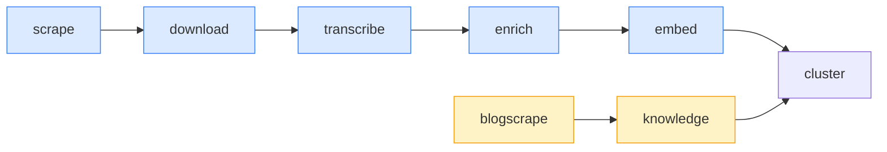
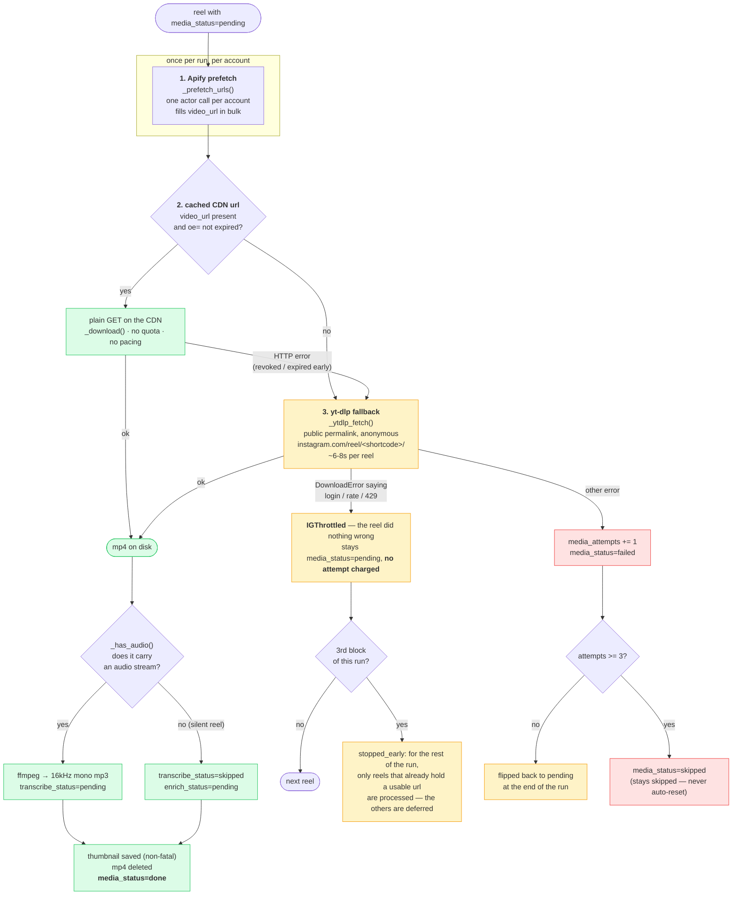

# Low-level: the processing pipeline

How raw content becomes searchable knowledge. This is the eight-stage nightly job.

## Where it lives

- **Runner:** `BEC/pipeline/dag.py` — a small linear DAG. It holds an ordered list of
  `Step(name, fn, fatal=False)` and runs them with `DAG.run(ctx, only, skip)`. Every step is
  **non-fatal**: if `scrape` fails, the later stages still run on whatever is already in the
  database.
- **Entry point:** `BEC/core/management/commands/run_pipeline.py`. Its docstring says
  *"DAG entrypoint (cron calls this)"*.
- **One agent per stage:** `BEC/pipeline/agents/<stage>_agent.py`, each exposing `run(...)`.

`pipeline/` is a plain Python package, **not** a Django app.

## The eight stages, in order

`STAGE_NAMES` (in `run_pipeline.py`):

```
scrape → download → transcribe → enrich → embed → blogscrape → knowledge → cluster
```



| # | Stage | Agent file | What it does | Sets next state |
|---|---|---|---|---|
| 1 | **scrape** | `scraper_agent.py` | For each active `TrackedAccount`: resolve profile (GraphQL primary → instaloader fallback), page through reels skipping known shortcodes, dump raw node JSON to `data/raw/{account}/{shortcode}.json`, upsert `Reel` rows. Rate discipline from `ScraperConfig`. | `media_status=pending` |
| 2 | **download** | `downloader_agent.py` | For `media_status=pending`: get the mp4 (three sources, cheapest first — [below](#how-a-reels-video-actually-arrives)), ffmpeg-extract audio → `media/audio/{account}/{shortcode}.mp3`, save thumbnail → `media/thumbs/…`, delete the mp4. 3 attempts then `skipped`; a block defers the reel instead of charging it an attempt. | `media_status=done`, `transcribe_status=pending` |
| 3 | **transcribe** | `transcriber_agent.py` | faster-whisper (local CPU, int8) over each mp3 → `Transcript`. Remote STT (`llm.client.transcribe_audio`) is used instead when `USE_REMOTE_STT`. Also processes `UploadedMedia`. | `transcribe_status=done`, `enrich_status=pending` |
| 4 | **enrich** | `enrich_agent.py` | One LLM call per `enrich_status=pending` reel → `Enrichment` (summary, topics, hook, target, format, `primary_topic`, `evidence`). Runs `ENRICH_WORKERS` (default 5) in parallel. Then extracts `ReelArgument`s for `argument_status=pending` — each with a required **verbatim quote**. | `enrich_status=done`, `argument_status` advanced |
| 5 | **embed** | `embed_agent.py` | Give every enriched reel a `vector` (via `cluster_agent._ensure_reel_embeddings`) and compute `chunk_vectors` passage embeddings for reels **and** documents (`_embed_passages`). Split from `enrich` on purpose so "analysed" and "searchable" can never drift apart. | embeddings written |
| 6 | **blogscrape** | `blogscrape_agent.py` | For each active `BlogSource`, self-throttling on `crawl_interval_h`: discover article URLs (`blog_discovery.py`) and ingest new ones (`blog_agent.py` — trafilatura → Markdown → `KnowledgeDocument`). Deactivates a source after N consecutive failures. | new `KnowledgeDocument` rows |
| 7 | **knowledge** | `knowledge_agent.py` | Enrich + embed blog articles (Medyca's and competitors'), using `model_for("analysis")`: `primary_topic`, on-topic verdict, `DocumentArgument` extraction (verbatim quote required). No hook/format — those are video-craft only. | `enrich_status`/`embed_status`/`argument_status=done` |
| 8 | **cluster** | `cluster_agent.py` | Two-layer clustering (below). Writes a fresh `ClusterRun` **per scope**, flips `is_current` atomically, then refreshes `CustomTopic` matches (`core/custom_topics.recompute_matches`). | new current `ClusterRun` per scope |

### How a reel's video actually arrives

Stage 2 is the only stage that touches Instagram, and Instagram is the part of the
system that fights back. There is no official way to download a reel's mp4, so the
downloader tries **three sources, cheapest and safest first**, and falls through.



**1. Apify prefetch** (`_prefetch_urls`, only when `apify_provider.enabled()`). One actor
call per account fills `video_url` for the whole batch, plus any missing caption /
thumbnail / counters. Depth is `max(reels known for that account, reels in this batch) + 60`
— a flat margin, because our pending rows sit scattered through the account's real
timeline, not at the top of it: a first attempt sized from the batch asked for 7 reels and
matched 0 of them. Overshooting costs a fraction of a cent; undershooting wastes the call.

**2. The cached CDN url.** Instagram signs media urls with `oe=<hex unix timestamp>`;
past it the CDN answers 403. `_url_expired()` reads that parameter with a 15-minute margin.
A url with no `oe=` is assumed good — the download attempt decides. This path is a plain
`requests` GET against the CDN, which has **no quota**, so the run does not pace itself here.

**3. yt-dlp on the public permalink** (`_ytdlp_fetch`). Downloads
`https://www.instagram.com/reel/<shortcode>/` **anonymously — no account, no cookies**.
This replaced the old renewal path (`/api/v1/media/{pk}/info/`), which needed a logged-in
session and was removed on **2026-07-29** because it ran as Giuseppe's personal account.
Measured from this VPS on **2026-07-30**: 3/3 reels, 6-8s each, valid MP4s with correct
durations.

#### The limits, written down before the next person hits them

- **yt-dlp is unofficial.** Instagram can block the IP or change the page at any time.
  A block arrives as a `yt_dlp.utils.DownloadError` whose text mentions *login*, *rate*,
  *429* or *wait a few minutes* — mapped to `IGThrottled` so the run **defers** instead of
  burning three attempts per reel on a wall that is not the reel's fault.
- **A block ends the run early, on purpose.** After the 3rd block (`_THROTTLE_STREAK`,
  counted *total*, not consecutive) the run sets `stopped_early` and from then on skips only
  the reels that would need the network — reels holding a fresh url keep going. Counting
  consecutively was the bug: a run alternates between reels that succeed and reels that are
  blocked, every success reset the streak, and the run paid the 20-40s pacing sleep on every
  doomed call — **2 reels/min instead of ~12**.
- **Pacing applies only after a web hit.** `_process_one` returns `used_api`; the loop sleeps
  `uniform(download_delay_s, 2 × download_delay_s)` only when the previous reel actually went
  out to Instagram. Sleeping after CDN cache hits would waste hours.
- **A reel can be silent.** `has_audio=False` means every video stream is video-only:
  transcription is skipped and the reel goes straight to enrichment on its caption.
- **Order and cap.** Medyca's own reels first (`owner_type="owned"`), then each competitor's
  best-performing ones, so a 122-reel account cannot starve the other twelve. Per-run size is
  capped by `ScraperConfig["download_max_per_run"]`; the backlog drains across runs.
- **`_fetch_media_details` still exists** and is still the only source of the richer metadata,
  but it needs cookies. With no session file it raises `IGThrottled` rather than failing the
  reel.

### What "cluster" actually does

- **Layer 1 (content → themes).** Embed each enriched reel + the `owned`/`competitor`
  documents. Cluster with **HDBSCAN** (`min_cluster_size=4`, `min_samples=2`; requires n ≥ 60,
  ≥ 3 clusters, noise ≤ 0.6). If that fails the size test, fall back to **Agglomerative**
  (cosine, `distance_threshold` from `ScraperConfig`, default `0.30`). Each cluster is named in
  Italian by one LLM call (`model_for("analysis")`). A new cluster reuses the previous run's
  label when centroid cosine ≥ 0.80, so themes keep stable names run to run.
- **Layer 2 (claims → themes).** Assign each `ReelArgument` to the nearest centroid; cosine
  < 0.35 counts as noise.
- Runs **once per scope** (`owned`, then `competitor`) — the two sides never share a cluster.

## The idempotency contract

The pipeline is safe to run on a fixed schedule because **state lives on each row**, not in
the runner. A stage selects only rows in the `pending` state for its column, does its work,
and advances the column. Re-running does no double work. Failures stay `failed` and are *not*
auto-reset — see [01-data-model.md](01-data-model.md#shared-vocabulary).

## Management commands

All under `BEC/core/management/commands/`. Run with `python manage.py <name>`.

| Command | Purpose |
|---|---|
| `run_pipeline` | Run the DAG. Flags: `--dry-run`, `--limit`, `--only <stage>`, `--skip-<stage>`. |
| `run_job <id>` | Execute a queued `Job` by id, detached. |
| `reprocess` | Re-run stages (`transcribe`, `enrich`, `knowledge`), resumable. Flags: `--stage`, `--scope`, `--limit`, `--only-stale`, `--with-transcript`, `--not-model`. |
| `ingest_blog` | Fetch a specific Medyca blog article (or several). |
| `import_apify` | Fill `video_url`/`caption`/`posted_at`/`duration` from an Apify export. |
| `backfill_meta` | Backfill `posted_at` and other metadata. |
| `autotag` | Generate auto `Tag`s from `primary_topic` (reels + docs). |
| `eval_mcp` | Run the MCP connector eval suite (retrieval, integrity, latency, judge). |
| `graph_check` | Verify the IG Graph token / caller / discoverability. |
| `ig_session` | Import / test Instagram cookies. |
| `progress` | Live pipeline progress bar. |
| `seed_client_user` | Create the client user + token + `ScraperConfig` defaults. |
| `seed_demo` | Create synthetic demo reels. |

## Scheduling

The cron schedule is **not committed inside `BEC/`** — `run_pipeline.py` declares itself the
cron entrypoint and the actual schedule lives on the host (see `deploy/crontab.txt`). The
pipeline is idempotent and self-throttling (blogscrape respects each source's
`crawl_interval_h`), so a fixed nightly run is safe. Background work triggered from the UI
(ideation, drafts, uploads, blog-source discovery) runs as detached `Job` rows via `run_job`,
not through the nightly DAG.

Next: [LLM and embeddings](03-llm-and-embeddings.md).
