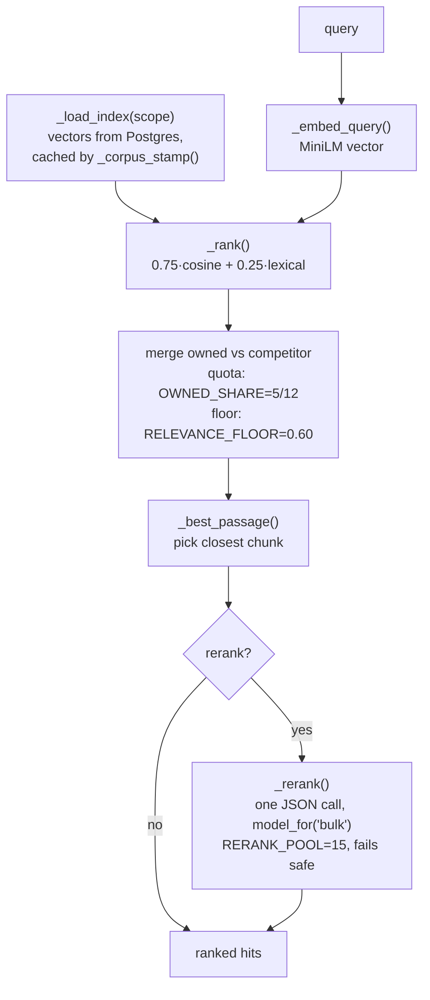

# Low-level: LLM, speech-to-text, embeddings, and RAG

Which models the platform uses, how it picks them, and how search actually ranks results.

## The model the platform runs on

The code is **vendor-neutral on purpose**. Nothing in the source names an LLM vendor. Code
asks for a *tier* and the concrete model id comes from config (`BEC/config/settings/base.py`,
overridable in `BEC/.env`). Swapping providers is an env change, not a code change.

### `model_for(task)` — the three tiers

Defined in `BEC/llm/client.py`. Callers ask for a task, not a model:

| Tier call | Used for |
|---|---|
| `model_for("analysis")` | the *strongest* model: reading transcripts, extracting claims/themes, naming clusters |
| `model_for("reasoning")` | strategy briefs, blog drafts, and the **RAG chat answer** |
| `model_for("bulk")` | high-volume mechanical extraction, the **search reranker**, blog URL-pattern classification |

It returns the tier's model **on the first live provider**. Callers pass that string back as
`chat(model=...)`; `chat()` re-resolves it per provider via `_task_of()` as it walks the chain,
so a caller never needs to know who will answer — and provider #2 is never asked for provider
#1's model name, which it would 404 on.

### The provider chain (ordered, one entry per provider)

`LLM_PROVIDER_ORDER` (default `fast,ollama`) picks the *kinds* of provider; `LLM_ENDPOINTS`
lists the remote ones **in priority order**, each with its own url, key, dialect and models:

```
LLM_ENDPOINTS=anthropic,groq,flow
LLM_ANTHROPIC_BASE_URL / _API_KEY / _MODEL_ANALYSIS / _MODEL_REASONING / _MODEL_BULK
LLM_GROQ_...  / _MODEL_CHAIN     (same-provider fallbacks for daily caps)
```

A `.env` written before the chain existed still works: with `LLM_ENDPOINTS` unset, one endpoint
is built from the old `LLM_*` / `FAST_LLM_*` names.

**Dialects.** Most providers speak OpenAI's shape (`POST /chat/completions`, `Authorization:
Bearer`) and go through `_fast_chat`. Anthropic's own API does not — different path
(`/v1/messages`), different header (`x-api-key`), system prompt as a top-level field — so it has
`_anthropic_chat`. The dialect is stored on the endpoint (`LLM_<NAME>_DIALECT`, auto-detected
for `api.anthropic.com`), never guessed at call time.

- **fast** — every entry of `FAST_ENDPOINTS`, in order.
- **hf** — HuggingFace `InferenceClient`. Dormant (not in the order).
- **ollama** — local, the last resort. Serialized by a file lock (`_ollama_slot`) because the
  CPU fits one ~7B generation at a time; an interactive caller can claim `priority`.

Errors, and what each one does to the chain:

| Response | Exception | Effect |
|---|---|---|
| 429 | `LLMRateLimit` | waits `retry-after` (≤60s); if the cap is *daily*, walks that provider's own `_MODEL_CHAIN` — free tiers cap tokens per model per day, so a sibling model still has budget |
| 401 / 402 / 403 | `LLMCreditError` | **that endpoint only** is skipped for the rest of the process; the next one answers |
| 404 | `LLMModelMissing` | the provider is fine, the model name is not on it: move to the next endpoint **without** disabling this one |
| anything else | logged at WARNING, retried, then next endpoint | a misconfigured provider must never fail silently |

> **Why per-endpoint and not global.** Until 2026-09-13 one flag disabled the whole remote
> layer, so a single dead gateway dropped everything to the local 3B model — silently. Measured
> damage: of 1066 enrichments, 947 were done by `claude-opus-5` and **61 by `ollama:qwen2.5:3b`**
> after the gateway's balance ran out, with 164 more left `failed`. `Enrichment.llm_model` records
> the model that *actually* served (`last_model_used()`), which is the only way that was visible.

### Deployed configuration (2026-09-13)

| Priority | Provider | Analysis / Reasoning | Bulk | Notes |
|---|---|---|---|---|
| 1 | **Anthropic** (`api.anthropic.com`) | `claude-sonnet-5` | `claude-sonnet-5` | paid per token, the project's own key |
| 2 | **Groq** (`api.groq.com/openai/v1`) | `openai/gpt-oss-120b` | `openai/gpt-oss-20b` | free, no card, ~30 RPM, ~0.4s per call |
| 3 | **aiapiflow** (gateway) | `claude-opus-5` | `claude-sonnet-4-6` | **balance exhausted** (403 `INSUFFICIENT_BALANCE`); revives by itself if topped up |
| 4 | **Ollama** (local) | `qwen2.5:3b-instruct-q4_K_M` | same | last resort, ~1-3 tok/s on this CPU |

Known limits, measured rather than assumed:

- **No sampling parameters on current Claude models.** `temperature` / `top_p` / `top_k` were
  removed on Sonnet 5, Opus 5 and the 4.7+ family; the SDK rejects the keyword outright
  (`Messages.create() got an unexpected keyword argument 'temperature'`). `_anthropic_chat`
  therefore does not send it — determinism comes from the prompt.
- Groq retired `llama-3.3-70b-versatile` and `llama-3.1-8b-instant`; both 404 on this account.
  Live catalogue: `openai/gpt-oss-120b`, `openai/gpt-oss-20b`, `qwen/qwen3.8-27b`,
  `qwen/qwen3.6-27b`, `groq/compound`, `groq/compound-mini`, `whisper-large-v3`.
- **gpt-oss models emit reasoning tokens before the answer**, billed against `max_tokens`. One
  enrichment prompt: 406 completion tokens at default effort, 263 at `reasoning_effort: low`,
  identical JSON quality. At `max_tokens=20` the answer came back **empty** with
  `finish_reason: "stop"` — a silent failure. `_fast_chat` sets `reasoning_effort: low` on any
  `gpt-oss` model.
- Groq's free tier caps requests per day per model (order of 250-1,000; read the live figure in
  console.groq.com → Settings → Limits). That is what `_MODEL_CHAIN` is for.
- **There is no token or cost accounting inside the platform.** Usage is read on the provider's
  own dashboard; the only internal trace is which model served each row (`llm_model`).
- aiapiflow resells Claude access, which the project rule "niente credenziali di terze parti
  rivendute" is about. It is kept last so the platform does not depend on it.

### Batch: the same models at half price

`BEC/llm/batch.py` + `BEC/pipeline/agents/batch_agent.py`. The Batch API answers **within 24h**
(usually inside an hour) and charges **50%**. Bulk nightly analysis does not need an answer in
two seconds, so it goes here; anything interactive keeps using `client.chat()`.

Because a batch cannot return a string synchronously, the work splits in two and the `batch`
DAG stage runs **collect before submit**:

```
notte 1   collect()  → writes down whatever last night's delivery produced
          submit()   → hands over everything still pending
notte 2   collect()  → those answers land
```

- Work in flight carries `Reel.enrich_status = "batched"` (a real status, migration 0020). The
  pending query cannot see it, so the next run cannot resubmit and pay twice.
- `BatchRun` (table `batch_runs`) is the receipt: provider batch id, the model, and the
  `custom_id → reel_id + evidence` mapping. **Results come back in any order and are matched by
  `custom_id`** (`reel-1251`) — matching by position would file one reel's analysis under
  another reel, permanently.
- An `errored` / `expired` / unparseable result sets the reel to `failed` with the reason.
  Nothing requeues automatically; `manage.py sonnet_batch --retry-failed` is the human saying
  "try again".
- If the delivery is refused, the rows stay `pending` and the ordinary `enrich` stage does them
  live the same night — degraded, never lost.

**Re-embed after a re-analysis.** A document's vector is built from its title, summary and
topics as well as its body, so rewriting an analysis leaves the old vector in place and the
document keeps being found by the wrong questions. `embed_status` says `done`, so nothing
revisits it on its own — set it back to `pending` for the rows you re-analysed. This bit the 323
articles recovered on 2026-09-13: their summaries had been empty when they were first embedded.

Commands: `manage.py sonnet_batch --status | --submit | --collect | --live | --retry-failed |
--redo-model <prefisso> | --cancel <id>`, each accepting `--kind reel_enrich | doc_enrich |
doc_arguments | all` and `--limit N`. Settings: `BATCH_ENABLED`, `BATCH_MODEL`,
`BATCH_MAX_REQUESTS`.

**Three kinds of work** go through it, declared once in `batch_agent.KINDS` — `reel_enrich`,
`doc_enrich`, `doc_arguments` — each saying which rows are owed, how to build the prompt and how
to write the answer. A fourth is one entry in that table.

**Token ceilings are a correctness issue, not a cost knob.** A truncated answer is unparseable
JSON — a *lost* analysis, not a shorter one — and output is billed on what is produced, so a
generous ceiling is free on the answers that already fit. Measured on the 2026-09-13 backlog run
(Sonnet 5): at `max_tokens=700`, 6 of ~150 enrichment answers truncated; at 1200, 2 more still
did (`stop_reason=max_tokens` at exactly the ceiling); claim extraction at 600 lost **74 of
139**. Current values: `ENRICH_MAX_TOKENS = 2000`, claim extraction 1200. Both
`_anthropic_chat` and `batch.collect()` now check `stop_reason == "max_tokens"` and say
"risposta troncata", instead of letting it surface as a confusing JSON parse error.

The model also occasionally wraps the object in an array (`[{...}]`) — 10 of ~150 answers.
`write_enrichment` unwraps a single-element list rather than throwing away a paid answer.

Measured cost on this corpus (1.113 transcripts, ~1.500 input / ~400 output tokens per reel):

| | Full corpus | Per night (new content) |
|---|---|---|
| live calls, Sonnet 5 | ~8 $ | cents |
| **batch, Sonnet 5** | **~4 $** | cents |

## Speech-to-text

- **Remote (preferred when `USE_REMOTE_STT`):** `whisper-large-v3` via `transcribe_audio()`,
  configured with `STT_BASE_URL` / `STT_API_KEY`. Deliberately a **separate endpoint** from the
  text LLM so the two can scale and fail independently.
- **Local fallback:** faster-whisper (`WHISPER_MODEL=small`, int8) on CPU.

## Embeddings

- **Model:** `EMBEDDINGS_MODEL = sentence-transformers/paraphrase-multilingual-MiniLM-L12-v2`
  (a local multilingual MiniLM). Loaded lazily in `core/knowledge.py` (`_get_embedder`) and in
  `cluster_agent._get_embedder`.
- Vectors are **normalized**, so cosine similarity = a dot product.
- **Storage:** JSON columns in Postgres — no pgvector (see
  [01-data-model.md](01-data-model.md#why-embeddings-are-json-not-pgvector)).
- **What text gets embedded for a reel:** `enrichment.summary_it` + `topics` +
  `transcript[:4000]` (`_EMBED_TEXT_CHARS`). The 4000-char cap matters: an earlier version
  read only `transcript[:600]`, which made anything past ~40 seconds invisible to ranking.

## Retrieval / RAG — `core/knowledge.py`

This one module powers both the in-app chat **and** the MCP `cerca` tool. Same code, same
ranking.



### `semantic_search(query, top_k, scope, rerank)`

1. **Load index** — `_load_index(scope)` reads all vectors from Postgres and caches them in
   `_INDEX_CACHE`, keyed on a cheap `_corpus_stamp()` fingerprint (uses `Max(updated_at)` so
   in-place re-embeds invalidate the cache). Only `is_active=True, is_on_topic=True` documents
   and `enrich_status=DONE` reels with non-empty text are indexed.
2. **Embed the query** — `_embed_query()`.
3. **Hybrid rank** — `_rank()` blends dense and lexical: `0.75 * cosine + 0.25 * lexical_score`.
   The lexical term (`_lexical_score`) is what catches exact drug/brand names like "Bijuva"
   that a fuzzy vector might miss.
4. **Keep the two sides fair** — under `scope="all"`, owned and competitor are ranked
   *separately* then merged with a quota: `OWNED_SHARE = 5/12` and a relevance floor
   `RELEVANCE_FLOOR = 0.60`. This stops the bigger corpus from crowding out Medyca's smaller
   one. Queries that mention "blog"/"articol…" reserve half the slots for articles.
5. **Pick the passage** — `_best_passage()` selects the chunk (from cached `chunk_vectors`)
   closest to the query, so a hit shows the *relevant* passage, not the article's first lines.
6. **Optional rerank** — `_rerank(query, out)` makes **one** structured LLM call
   (`model_for("bulk")`) over a `RERANK_POOL=15` candidate pool, asking for a JSON
   `{"ordine": [...]}` ordering, then returns the top `top_k`. On *any* failure it falls back to
   the blend order — it never errors out. Both the chat and MCP `cerca` call it with
   `rerank=True`.

### `answer()` — the grounded chat

`answer()` / `_prepare()` build the RAG chat reply:
- Retrieve with `semantic_search`, then generate with `model_for("reasoning")`.
- The system prompt **forbids outside knowledge**, requires numbered `[n]` citations, and
  keeps Medyca vs competitor material strictly labelled and separated.
- A URL pasted into a question is fetched on the fly via `core/external_ref.fetch_reference`
  (SSRF-guarded), used **only** for that one answer, marked external, and never added to the
  bank.

Next: [the MCP connector](04-mcp-connector.md).
