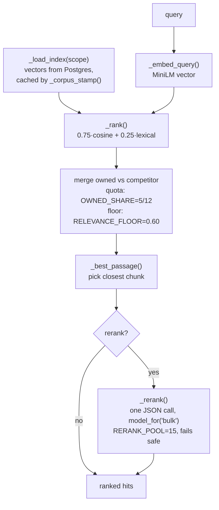

# Low-level: LLM, speech-to-text, embeddings, and RAG

Which models the platform uses, how it picks them, and how search actually ranks results.

## The model the platform runs on

The code is **vendor-neutral on purpose**. Nothing in the source names an LLM vendor. Code
asks for a *tier* and the concrete model id comes from config (`BEC/config/settings/base.py`,
overridable in `BEC/.env`). Swapping providers is an env change, not a code change.

### `model_for(task)` — the three tiers

Defined in `BEC/llm/client.py` (~lines 286–303). Callers ask for a task, not a model:

| Tier call | Resolves to (first set wins) | Used for |
|---|---|---|
| `model_for("analysis")` | `LLM_MODEL_REASONING_3` → `_2` → `_REASONING` → `FAST_LLM_MODEL` | the *strongest* model: reading transcripts, extracting claims/themes, naming clusters |
| `model_for("reasoning")` | `LLM_MODEL_REASONING_2` → `FAST_LLM_MODEL` | strategy briefs, blog drafts, and the **RAG chat answer** |
| `model_for("bulk")` | `FAST_LLM_MODEL_BULK` | high-volume mechanical extraction, and the **search reranker** |

> In the deployed config these tiers map to Claude Opus-class models for analysis/reasoning
> and a fast model for bulk. But the code never hard-codes that — read the `.env` to know what
> is actually serving. The in-app Documentazione page states the client-facing mapping
> (Whisper large-v3 · Opus 5 for analysis/clustering · Opus 4.8 for chat/plan · MiniLM for search).

### The provider fallback chain

`llm/client.py` walks providers in `LLM_PROVIDER_ORDER` (default `fast,ollama`; the shipped
`.env.example` runs `ollama` only, with HF dormant):

- **fast** (`_fast_chat`) — any OpenAI-compatible endpoint (Groq / Cerebras / OpenRouter / an
  Anthropic-compatible gateway / …). Provider-agnostic.
- **hf** (`_hf_chat`) — HuggingFace `InferenceClient`.
- **ollama** (`_ollama_chat`) — local. Serialized by a file lock (`_ollama_slot`,
  `OLLAMA_LOCK_PATH`) because the CPU only fits one ~7B generation at a time; an interactive
  caller can claim `priority`.

`chat()` handles retries and errors: `LLMRateLimit` on 429 (walks `FAST_LLM_MODEL_CHAIN` when a
daily budget is exhausted), `LLMCreditError` on 402 (disables that provider). `chat_json()` /
`parse_json()` give structured output. `last_model_used()` records the model that actually
served — that string is what gets stored in `Enrichment.llm_model`, `BlogDraft.llm_model`, etc.

## Speech-to-text

- **Remote (preferred when `USE_REMOTE_STT`):** `whisper-large-v3` via `transcribe_audio()`,
  configured with `STT_BASE_URL` / `STT_API_KEY`. Deliberately a **separate endpoint** from the
  text LLM so the two can scale and fail independently.
- **Local fallback:** faster-whisper (`WHISPER_MODEL=small`, int8) on CPU.

## Embeddings

- **Model:** `EMBEDDINGS_MODEL = sentence-transformers/paraphrase-multilingual-MiniLM-L12-v2`
  (a local multilingual MiniLM). Loaded lazily in `core/knowledge.py` (`_get_embedder`) and in
  `cluster_agent._get_embedder`.
- Vectors are **normalized**, so cosine similarity = a dot product.
- **Storage:** JSON columns in Postgres — no pgvector (see
  [01-data-model.md](01-data-model.md#why-embeddings-are-json-not-pgvector)).
- **What text gets embedded for a reel:** `enrichment.summary_it` + `topics` +
  `transcript[:4000]` (`_EMBED_TEXT_CHARS`). The 4000-char cap matters: an earlier version
  read only `transcript[:600]`, which made anything past ~40 seconds invisible to ranking.

## Retrieval / RAG — `core/knowledge.py`

This one module powers both the in-app chat **and** the MCP `cerca` tool. Same code, same
ranking.

### `semantic_search(query, top_k, scope, rerank)`

1. **Load index** — `_load_index(scope)` reads all vectors from Postgres and caches them in
   `_INDEX_CACHE`, keyed on a cheap `_corpus_stamp()` fingerprint (uses `Max(updated_at)` so
   in-place re-embeds invalidate the cache). Only `is_active=True, is_on_topic=True` documents
   and `enrich_status=DONE` reels with non-empty text are indexed.
2. **Embed the query** — `_embed_query()`.
3. **Hybrid rank** — `_rank()` blends dense and lexical: `0.75 * cosine + 0.25 * lexical_score`.
   The lexical term (`_lexical_score`) is what catches exact drug/brand names like "Bijuva"
   that a fuzzy vector might miss.
4. **Keep the two sides fair** — under `scope="all"`, owned and competitor are ranked
   *separately* then merged with a quota: `OWNED_SHARE = 5/12` and a relevance floor
   `RELEVANCE_FLOOR = 0.60`. This stops the bigger corpus from crowding out Medyca's smaller
   one. Queries that mention "blog"/"articol…" reserve half the slots for articles.
5. **Pick the passage** — `_best_passage()` selects the chunk (from cached `chunk_vectors`)
   closest to the query, so a hit shows the *relevant* passage, not the article's first lines.
6. **Optional rerank** — `_rerank(query, out)` makes **one** structured LLM call
   (`model_for("bulk")`) over a `RERANK_POOL=15` candidate pool, asking for a JSON
   `{"ordine": [...]}` ordering, then returns the top `top_k`. On *any* failure it falls back to
   the blend order — it never errors out. Both the chat and MCP `cerca` call it with
   `rerank=True`.

### `answer()` — the grounded chat

`answer()` / `_prepare()` build the RAG chat reply:
- Retrieve with `semantic_search`, then generate with `model_for("reasoning")`.
- The system prompt **forbids outside knowledge**, requires numbered `[n]` citations, and
  keeps Medyca vs competitor material strictly labelled and separated.
- A URL pasted into a question is fetched on the fly via `core/external_ref.fetch_reference`
  (SSRF-guarded), used **only** for that one answer, marked external, and never added to the
  bank.

Next: [the MCP connector](04-mcp-connector.md).
