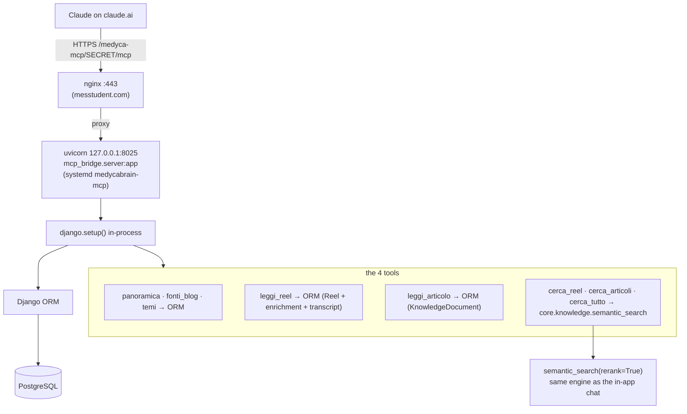

# Low-level: the MCP connector (how Claude queries the data)

The `Medyca` MCP connector lets Claude on claude.ai query the knowledge bank directly. It
exposes **ten read-only tools** in Italian. This page traces exactly what each one does down
to the database.

**Reels and blog articles have their own tools.** They answer different questions — a reel has a
spoken hook, a video format and an audience; an article has a source, an author, a language and
a body — and one mixed tool made Claude pick the wrong side of the corpus for questions that
were plainly about one of them. The cross-type tools remain for questions that genuinely span
both:

| | reels (video) | articles (blog) | both |
|---|---|---|---|
| search | `cerca_reel` | `cerca_articoli` | `cerca_tutto` |
| read one | `leggi_reel` | `leggi_articolo` | `leggi` |
| context | — | `fonti_blog` | `panoramica`, `temi` |
| reference material | `cerca_riferimenti` (videos, talks — carries the link) | | |

## Where it lives

- **The server:** `BEC/mcp_bridge/server.py` (~383 lines) — the whole thing.
- `BEC/mcp_bridge/__init__.py` — empty package marker.
- **The retrieval engine it reuses:** `BEC/core/knowledge.py` (`semantic_search`, the
  reranker, the embedder).
- **The models it queries:** `BEC/core/models.py`.
- **Deployment unit:** `deploy/medycabrain-mcp.service`.
- **Human-facing setup doc:** `BEC/docs/mcp-connettore-claude.md`.
- **Eval suite:** `BEC/core/management/commands/eval_mcp.py` (tests the *live* MCP over HTTP).

It is **not** a Django management command and **not** stdio. It is a standalone
**ASGI / HTTP** server built on the official MCP Python SDK (`from mcp.server.mcpserver import
MCPServer`), which calls `django.setup()` in-process so it can use the ORM. The ASGI app is
`mcp_bridge.server:app`.

## How it connects to the data



Both paths run **in one process**. There is **no internal HTTP call** to the REST API —
`panoramica`, `fonti_blog`, the `leggi*` tools and `temi` are plain ORM queries; the
`cerca*` tools go through the
`semantic_search()` + reranker path in `core.knowledge` (the same retrieval the web chat uses,
so Claude gets the same ranked results the app would show).

All ten tools are registered with `@server.tool(...)` on an `MCPServer` named
**"Medyca Content Intelligence"**. All four are read-only.

## The tools

### `panoramica()` — corpus overview
No parameters. Returns a dict of counts, all via ORM aggregation:
- Reels per side: `Reel.objects.filter(is_active=True).values_list("account__owner_type").annotate(n=Count("id"))`
  → split `medyca` (owner_type `owned`) vs `competitor`.
- Articles: `KnowledgeDocument.objects.filter(is_active=True, is_on_topic=True).values_list("owner_type").annotate(n=Count("id"))`.
- Tracked IG accounts: `TrackedAccount.objects.filter(is_active=True).values_list("username", flat=True)`.
- Monitored blogs: `BlogSource.objects.filter(is_active=True).values_list("name", flat=True)`.
- Theme counts: for each `ClusterRun.objects.filter(is_current=True)`, count
  `TopicCluster.objects.filter(run=run)`.
- **`materiale_di_riferimento`**: `{totale, con_trascrizione, solo_link}` over
  `is_inspiration=True`. Counted apart from `articoli` on purpose — folding videos into the
  article totals would quietly inflate the numbers every answer is anchored on, and
  `solo_link` is the honest count of items whose content we do NOT know.

### `cerca_reel` / `cerca_articoli` / `cerca_tutto` `(query, scope="all", limite=8)`
The three search tools share one implementation, `_search(query, scope, limite, only)` — they
differ only in which side of the corpus they keep, so they can never drift into ranking the same
question differently:

```python
hits = semantic_search(query, top_k=limite * (3 if only else 1), scope=scope, rerank=True)
if only:                       # "reel" | "blog" | None
    hits = [h for h in hits if h["kind"] == only]
```

- `scope` is clamped to `all` / `medyca` / `competitor`; `limite` clamped to 1–20.
- **The pool is over-fetched 3× when filtering**, or the filter starves: asking for 8 articles
  out of a pool of 8 mixed hits returns two.
- `rerank=True` — Claude gets the same LLM-sharpened order the in-app chat uses. The rerank step
  is best-effort and **fails fast to the blend order** (`retries=0`, `max_tokens=2000`); before
  2026-09-15 a truncated rerank was retried 3× and made search hang ~30–40s, which the client
  reported as "search not working" — see [03-llm-and-embeddings](03-llm-and-embeddings.md#6-optional-rerank).
- Each hit is shaped by `_hit(h)` into `{id, tipo, di, titolo, estratto, url, pertinenza}`,
  where `id` is `"reel:123"` / `"blog:45"` and `di` labels ownership.

For how `semantic_search` ranks, see
[03-llm-and-embeddings.md](03-llm-and-embeddings.md#retrieval--rag--coreknowledgepy).

### `leggi_reel(id)` / `leggi_articolo(id)` / `leggi(id)` — full text of one item
`_parse_id(id, atteso)` accepts `"reel:123"` or, for a typed tool that already knows the kind, a
bare `"123"` — Claude routinely passes the bare number, and refusing it is pedantry, not safety.
A typed tool given the other kind's id returns a readable redirect
(`"questo id non è un reel: usa leggi_articolo"`) rather than an empty result.

- **`leggi_reel`** — `Reel.objects.filter(id=pk, is_active=True).select_related("account","enrichment","transcript")`
  → transcript (truncated to 12 000 chars), caption, `primary_topic`, `summary_it`, `topics`,
  **plus the video-only fields**: `gancio` (`hook_text`), `analisi_gancio`, `formato`
  (`content_format`), `pubblico` (`target_audience_it`), views/likes, and claims via
  `r.arguments.all()[:10]` (each `text_it` + verbatim `quote`).
- **`leggi_articolo`** — `KnowledgeDocument.objects.filter(id=pk, is_active=True).select_related("source")`
  → `content_text` (falls back to `content_md`, truncated to 12 000), plus `ispirazione`,
  `trascrizione_disponibile` and a `nota` when there is no transcript; `tipo` reads
  "video di riferimento" for `source_type="video"`. Then `fonte`, `autore`,
  `lingua`, `pubblicato`, `primary_topic`, `summary_it`, `topics`, `in_tema` +
  `fuori_tema_perche`, and `d.arguments.all()[:10]`. Plain text on purpose, so a quote can be
  verified verbatim against exactly what Claude was given.
- **`leggi`** routes on the id prefix; it exists for `cerca_tutto` results.

### `cerca_riferimenti(query, scope="all", limite=8)` — the client's own reference shelf
Searches **only** the material flagged `is_inspiration` — TV episodes, talks, external videos the
client added on purpose — and every hit carries the source **link**, which is the whole point of
keeping them.

It ranks **inside** that subset (`semantic_search(..., only_inspiration=True)`), never by
filtering a general search afterwards: a handful of short reference cards never reaches the top
of a 1.483-item corpus, so a post-filter returns an empty list and reads as "we have nothing on
that" when we do. That was the first implementation and it returned 0 results every time.

**The on-topic verdict is reframed for this shelf.** `leggi_articolo` normally returns
`in_tema` / `fuori_tema_perche`. For reference material it returns `in_tema: true` plus a
`perimetro` line instead, because all 11 videos the client added came back `is_on_topic=False`
("tratta di alimentazione generale, senza riferimento a menopausa") — which is the correct
reading of a menopause-centred prompt and a useless thing to tell Claude about a source the
client deliberately chose. Said raw it reads as "ignore this". The judgement is still shown,
framed as what it is: material next door to the core subject.

Some of these have **only a title and a link, no transcript** (their audio could not be fetched —
see below). The tool description says so, and `leggi_articolo` returns
`trascrizione_disponibile: false` plus an explicit `nota` telling Claude not to attribute claims
it cannot read.

### `fonti_blog(scope="all")` — which written sources back an answer
`BlogSource` annotated with its active document count, ordered by size. Returns `{nome, di, url,
articoli, attiva, ultima_lettura, problema}` per source.

Its real job is telling Claude **what is not covered**: a question about a clinic whose blog is
not monitored must be answered "we do not track that source", not with silence that reads like
absence. `problema` carries `last_error`, so a source that has stopped producing is visible
rather than quietly empty.

### `temi(scope="competitor")` — the current theme map
Pure ORM over the cluster tables (`owner = "owned"` for `medyca`, else `"competitor"`):
- `run = ClusterRun.objects.filter(scope=owner, is_current=True).first()`.
- `TopicCluster.objects.filter(run=run).order_by("-size")[:40]`.
- Per cluster, sample claims: `ArgumentAssignment.objects.filter(run=run, cluster=c).select_related("argument")[:3]`.
- Returns `{id, tema (label_it), descrizione (description_it), contenuti (size),
  parole_chiave (keywords[:6]), esempi_affermazioni}`.

## Transport, deployment, and security

- **Transport:** Streamable HTTP, JSON responses, stateless. Built in `build_app()`:
  `server.streamable_http_app(json_response=True, stateless_http=True, transport_security=security)`.
- **DNS-rebinding protection is deliberately disabled**
  (`TransportSecuritySettings(enable_dns_rebinding_protection=False)`) — the SDK guard was
  returning `403` to claude.ai's own `Origin: https://claude.ai` requests.
- **Auth = a secret path segment.** The ASGI wrapper `app` gates every request behind
  `MCP_SECRET` (from `BEC/.env`). A `_clean()` step strips whitespace/invisible unicode from
  copy-pasted URLs and forgives a missing `/mcp` suffix. There is no OAuth/login — **the URL
  is the credential**. Full OAuth was judged disproportionate for a single client.
- **Public URL:** `https://messtudent.com/medyca-mcp/{MCP_SECRET}/mcp`. The server also serves a
  small "invito" HTML page (`MCP_INVITE`) with a copy button.
- **Process/port:** systemd unit `medycabrain-mcp` runs
  `venv/bin/uvicorn mcp_bridge.server:app --host 127.0.0.1 --port 8025 --workers 1`. It is its
  **own** process so a slow MCP call can't occupy a backend Gunicorn worker.
  > Known doc discrepancy: the `server.py` docstring says port **8020**, but the systemd unit
  > and the maintainer doc use **8025** (8020 was already taken). Trust 8025.
- **Warm start:** a daemon thread `_warm()` preloads the embedder and index on boot (cold first
  a search was ~14 s; warm ~0.5 s). The embedder load is behind a lock: warming runs in a
  background thread while requests are already being served, and two concurrent loads of
  SentenceTransformer leave it half-built (`Cannot copy out of meta tensor`).
- **HTTPS:** no dedicated DNS/cert for medycabrain — it rides `messtudent.com`'s existing 443
  cert via an nginx `location /medyca-mcp/` block that proxies to `127.0.0.1:8025`. **That
  nginx block is not in this repo** — `deploy/nginx-medycabrain.conf` is only the port-9093 app
  preview and has no MCP route.

## Registering it on claude.ai

Documented in `BEC/docs/mcp-connettore-claude.md`. On claude.ai → Settings → Connectors → Add
custom connector, name it `Medyca Content Intelligence`, paste the secret-path URL above; no
login. **Rotating the secret:** change `MCP_SECRET` in `BEC/.env` and
`systemctl restart medycabrain-mcp`. The client hand-off flow is scripted in
`BEC/tools/guida_alberto.sh`. Quality is checked with `python manage.py eval_mcp` (retrieval,
integrity, latency, and an LLM judge).

Next: [the REST API](05-rest-api.md).
