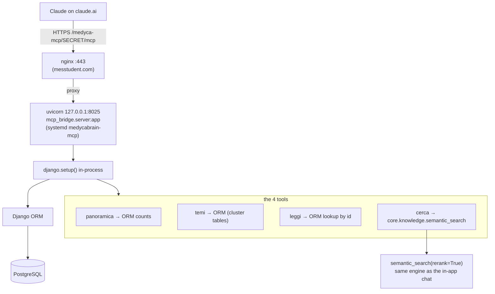

# Low-level: the MCP connector (how Claude queries the data)

The `Medyca` MCP connector lets Claude on claude.ai query the knowledge bank directly. It
exposes **four read-only tools** in Italian: `panoramica`, `cerca`, `leggi`, `temi`. This page
traces exactly what each one does down to the database.

## Where it lives

- **The server:** `BEC/mcp_bridge/server.py` (~383 lines) — the whole thing.
- `BEC/mcp_bridge/__init__.py` — empty package marker.
- **The retrieval engine it reuses:** `BEC/core/knowledge.py` (`semantic_search`, the
  reranker, the embedder).
- **The models it queries:** `BEC/core/models.py`.
- **Deployment unit:** `deploy/medycabrain-mcp.service`.
- **Human-facing setup doc:** `BEC/docs/mcp-connettore-claude.md`.
- **Eval suite:** `BEC/core/management/commands/eval_mcp.py` (tests the *live* MCP over HTTP).

It is **not** a Django management command and **not** stdio. It is a standalone
**ASGI / HTTP** server built on the official MCP Python SDK (`from mcp.server.mcpserver import
MCPServer`), which calls `django.setup()` in-process so it can use the ORM. The ASGI app is
`mcp_bridge.server:app`.

## How it connects to the data



Both paths run **in one process**. There is **no internal HTTP call** to the REST API —
`panoramica`, `leggi`, and `temi` are plain ORM queries; `cerca` goes through the
`semantic_search()` + reranker path in `core.knowledge` (the same retrieval the web chat uses,
so Claude gets the same ranked results the app would show).

All four tools are registered with `@server.tool(...)` on an `MCPServer` named
**"Medyca Content Intelligence"**. All four are read-only.

## The four tools

### `panoramica()` — corpus overview
No parameters. Returns a dict of counts, all via ORM aggregation:
- Reels per side: `Reel.objects.filter(is_active=True).values_list("account__owner_type").annotate(n=Count("id"))`
  → split `medyca` (owner_type `owned`) vs `competitor`.
- Articles: `KnowledgeDocument.objects.filter(is_active=True, is_on_topic=True).values_list("owner_type").annotate(n=Count("id"))`.
- Tracked IG accounts: `TrackedAccount.objects.filter(is_active=True).values_list("username", flat=True)`.
- Monitored blogs: `BlogSource.objects.filter(is_active=True).values_list("name", flat=True)`.
- Theme counts: for each `ClusterRun.objects.filter(is_current=True)`, count
  `TopicCluster.objects.filter(run=run)`.

### `cerca(query, scope="all", tipo="tutti", limite=8)` — semantic search
The only tool that runs the hybrid retrieval. It calls:

```python
from core.knowledge import semantic_search
hits = semantic_search(query, top_k=limite * (2 if tipo != "tutti" else 1),
                       scope=scope, rerank=True)
```

- `scope` is clamped to `all` / `medyca` / `competitor`; `limite` clamped to 1–20.
- When filtering by `tipo` it over-fetches 2× then post-filters hits by `kind` (`reel`/`blog`).
- `rerank=True` — Claude gets the same LLM-sharpened order the in-app chat uses.
- Each hit is shaped by the local `_hit(h)` helper into
  `{id, tipo, di, titolo, estratto, url, pertinenza}`, where `id` is `"reel:123"` / `"blog:45"`
  and `di` labels ownership (`"Medyca"` vs `"competitor: @account"`).

For how `semantic_search` ranks, see
[03-llm-and-embeddings.md](03-llm-and-embeddings.md#retrieval--rag--coreknowledgepy).

### `leggi(id)` — full text of one item
Parses `id` as `"reel:123"` or `"blog:45"`. Direct ORM lookups, no search:
- **Reel:** `Reel.objects.filter(id=pk, is_active=True).select_related("account","enrichment","transcript").first()`
  → transcript text (`transcript.text`, truncated to 12000 chars), enrichment
  (`primary_topic`, `summary_it`, `topics`), caption, view/like counts, and claims via
  `r.arguments.all()[:10]` (each `text_it` + verbatim `quote`).
- **Blog:** `KnowledgeDocument.objects.filter(id=pk, is_active=True).select_related("source").first()`
  → `content_text` (falls back to `content_md`, truncated to 12000), `summary_it`,
  `primary_topic`, `topics`, `author`, and `d.arguments.all()[:10]`. Plain text is returned on
  purpose so a quote can be verified verbatim.

### `temi(scope="competitor")` — the current theme map
Pure ORM over the cluster tables (`owner = "owned"` for `medyca`, else `"competitor"`):
- `run = ClusterRun.objects.filter(scope=owner, is_current=True).first()`.
- `TopicCluster.objects.filter(run=run).order_by("-size")[:40]`.
- Per cluster, sample claims: `ArgumentAssignment.objects.filter(run=run, cluster=c).select_related("argument")[:3]`.
- Returns `{id, tema (label_it), descrizione (description_it), contenuti (size),
  parole_chiave (keywords[:6]), esempi_affermazioni}`.

## Transport, deployment, and security

- **Transport:** Streamable HTTP, JSON responses, stateless. Built in `build_app()`:
  `server.streamable_http_app(json_response=True, stateless_http=True, transport_security=security)`.
- **DNS-rebinding protection is deliberately disabled**
  (`TransportSecuritySettings(enable_dns_rebinding_protection=False)`) — the SDK guard was
  returning `403` to claude.ai's own `Origin: https://claude.ai` requests.
- **Auth = a secret path segment.** The ASGI wrapper `app` gates every request behind
  `MCP_SECRET` (from `BEC/.env`). A `_clean()` step strips whitespace/invisible unicode from
  copy-pasted URLs and forgives a missing `/mcp` suffix. There is no OAuth/login — **the URL
  is the credential**. Full OAuth was judged disproportionate for a single client.
- **Public URL:** `https://messtudent.com/medyca-mcp/{MCP_SECRET}/mcp`. The server also serves a
  small "invito" HTML page (`MCP_INVITE`) with a copy button.
- **Process/port:** systemd unit `medycabrain-mcp` runs
  `venv/bin/uvicorn mcp_bridge.server:app --host 127.0.0.1 --port 8025 --workers 1`. It is its
  **own** process so a slow MCP call can't occupy a backend Gunicorn worker.
  > Known doc discrepancy: the `server.py` docstring says port **8020**, but the systemd unit
  > and the maintainer doc use **8025** (8020 was already taken). Trust 8025.
- **Warm start:** a daemon thread `_warm()` preloads the embedder and index on boot (cold first
  `cerca` was ~14 s; warm ~0.5 s).
- **HTTPS:** no dedicated DNS/cert for medycabrain — it rides `messtudent.com`'s existing 443
  cert via an nginx `location /medyca-mcp/` block that proxies to `127.0.0.1:8025`. **That
  nginx block is not in this repo** — `deploy/nginx-medycabrain.conf` is only the port-9093 app
  preview and has no MCP route.

## Registering it on claude.ai

Documented in `BEC/docs/mcp-connettore-claude.md`. On claude.ai → Settings → Connectors → Add
custom connector, name it `Medyca Content Intelligence`, paste the secret-path URL above; no
login. **Rotating the secret:** change `MCP_SECRET` in `BEC/.env` and
`systemctl restart medycabrain-mcp`. The client hand-off flow is scripted in
`BEC/tools/guida_alberto.sh`. Quality is checked with `python manage.py eval_mcp` (retrieval,
integrity, latency, and an LLM judge).

Next: [the REST API](05-rest-api.md).
