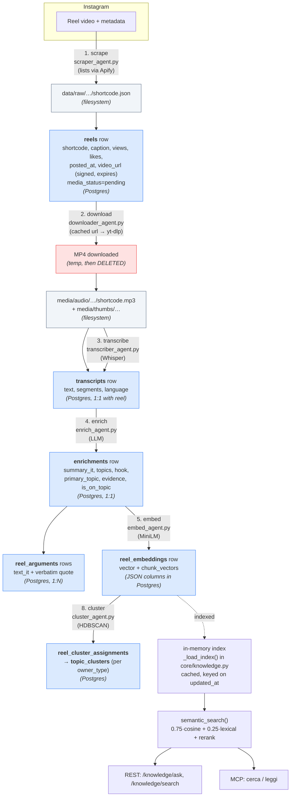
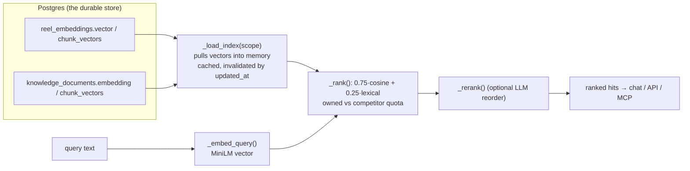

# Low-level: content lineage (from an Instagram video to a search hit)

This page follows **one reel** through the whole system and shows, at each step, **what gets
produced and where it is stored** — filesystem, a PostgreSQL table, or thrown away. If you ever
ask "where did this field come from?" or "is this in SQL?", this is the map.

The short answers:
- **Where does the video even come from?** Instagram gives us **no** way to list an account's
  reels anonymously anymore. So the list is bought from **Apify** (the `instagram-reel-scraper`
  actor — no Instagram account of ours is involved), and the MP4 of each listed reel is
  downloaded **for free with yt-dlp** from the public permalink. Full reasoning + budget in
  [02-pipeline.md](02-pipeline.md#where-the-list-of-reels-comes-from).
- **Is it in SQL?** Yes — everything *except the video file itself* ends in PostgreSQL. The MP4
  is downloaded, its audio + thumbnail are extracted, then **the MP4 is deleted**. Only the
  audio MP3 and the thumbnail stay on disk; all text, metadata, claims and **vectors** live in
  Postgres.
- **How is it indexed?** The text is turned into a **vector** (a MiniLM embedding) stored as a
  JSON column. At search time those vectors are loaded into an in-memory index and compared
  with cosine similarity. There is no pgvector and no separate search engine.

## Where each artifact lives

| Artifact | Storage | Kept? |
|---|---|---|
| The reel's MP4 video | downloaded (yt-dlp / cached CDN url) to a temp path | **deleted** after audio extraction |
| `video_url` (signed CDN link, from Apify) | `reels.video_url` column | kept, but **expires** (`oe=` timestamp on the URL) |
| Audio MP3 | filesystem `BEC/media/audio/{account}/{shortcode}.mp3` | kept (served by nginx `/media/`) |
| Thumbnail | filesystem `BEC/media/thumbs/…` | kept |
| Raw scraped JSON | filesystem `BEC/data/raw/{account}/{shortcode}.json` | kept (debug/backfill) |
| Caption, metrics, dates | `reels` table (Postgres) | kept |
| Transcript text | `transcripts` table (Postgres) | kept |
| LLM understanding | `enrichments` table (Postgres) | kept |
| Claims + verbatim quotes | `reel_arguments` table (Postgres) | kept |
| **Vectors (the index)** | `reel_embeddings.vector` + `.chunk_vectors` — **JSON columns in Postgres** | kept |
| Theme membership | `reel_cluster_assignments` (Postgres) | rewritten each run |

So: **binaries on disk (audio + thumbnail), everything else in Postgres.** The video is never
stored long-term.

## The lineage graph



Numbers on the arrows are the pipeline stages from
[02-pipeline.md](02-pipeline.md). Each stage only runs on rows whose status column is
`pending`, so re-running the nightly job never redoes finished work.

## Step by step

1. **scrape** — for each tracked account, the list of recent reels is fetched **from Apify**
   (Instagram no longer lets us list an account anonymously). The raw result is dumped to
   `data/raw/…`, and a `reels` row is created (caption, view/like counts, `posted_at`, and a
   **signed** `video_url`). `media_status` is set to `pending`. The `video_url` carries an `oe=`
   expiry — once past it the CDN returns 403, which is why download falls back to yt-dlp.
2. **download** — the MP4 is fetched cheapest-source-first (cached CDN `video_url` → **yt-dlp**
   on the public permalink, anonymously). ffmpeg extracts the **audio → MP3** and a
   **thumbnail**, then **the MP4 is deleted**. Disk now holds only the MP3 + thumbnail. A
   silent reel skips transcription and goes straight to enrich. Full three-source fallback:
   [02-pipeline.md](02-pipeline.md#how-a-reels-video-actually-arrives).
3. **transcribe** — Whisper turns the MP3 into text → a `transcripts` row (1:1 with the reel),
   with `segments` carrying per-line timestamps.
4. **enrich** — an LLM reads the transcript and caption and writes an `enrichments` row (the
   one specific `primary_topic`, `summary_it`, `topics`, `hook`, `target`, and an `evidence`
   verdict). It also extracts `reel_arguments`: short claims, each with a **verbatim quote** so
   nothing is invented.
5. **embed** — the text (`summary_it` + `topics` + `transcript[:4000]`) becomes a vector. Both a
   whole-reel `vector` and per-passage `chunk_vectors` are written to `reel_embeddings` as **JSON
   columns**. This is the moment the reel becomes *indexable*.
8. **cluster** — the reel's vector is grouped with similar ones into a `topic_cluster`, **within
   its own `owner_type`** (Medyca themes and competitor themes are built separately). Membership
   is written to `reel_cluster_assignments` and rewritten on each run.

## How indexing and search actually work

"Indexing" here does **not** mean a database index or an external engine like Elasticsearch. It
means: every piece of content has a **vector**, and search compares vectors.



1. **The vectors are the index.** They sit in the JSON columns written at stage 5/7.
2. **`_load_index(scope)`** (`core/knowledge.py`) reads those vectors into an **in-memory**
   structure the first time they're needed, and caches it. The cache key includes
   `Max(updated_at)`, so a re-embed automatically invalidates it.
3. **A query** is embedded the same way, then scored against every vector with
   `0.75·cosine + 0.25·lexical` (the lexical part catches exact names like "Bijuva"), keeping
   Medyca and competitor results fairly quota'd.
4. An optional **LLM reranker** reorders the top pool.
5. The result feeds the in-app chat (`/knowledge/ask`), the search endpoint, and the MCP tools
   `cerca` / `leggi`.

Full ranking detail: [03-llm-and-embeddings.md](03-llm-and-embeddings.md).

## Blog articles follow the same shape

A blog article is the text-only twin of a reel. There is no download/transcribe step — the
article text *is* the starting point:

```
blogscrape (find URL) → knowledge_documents row (content_text)
  → knowledge stage: enrich (summary/primary_topic/on-topic) + document_arguments (quote)
  → embed into knowledge_documents.embedding / chunk_vectors  ← same index as reels
  → cluster (within its owner_type)
```

Everything after "embed" is identical: articles and reels share one index and one search path,
which is why a single question can return both a reel and an article as sources.

Back to the [index](../README.md) · previous: [frontend](06-frontend.md).
